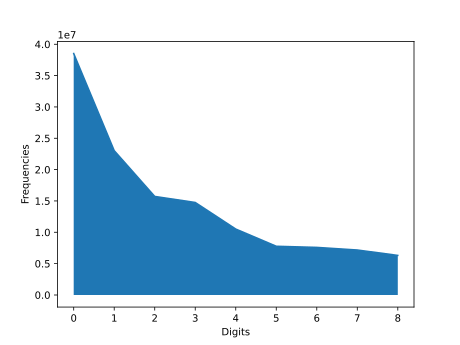

# Collatz-conjecture (aka, Syracuse Problem or Hasse's Algorithm)

Given an integer N, compute the stopping time(the number of times it takes to go from N to 1) and the highest number reached, using the '3x + 1' rule: if the current hailstone number, let's call it `x`, is odd, the next one would be `3x + 1`, otherwise it would be `x / 2`.

The interesting thing about this is that no matter what number you pick, it will eventually end up at 1.

The infinite loop (shown below) starts when you apply that rule to the number 1, because 1 is odd, you would have to use 3x + 1 to compute the next number, and the result would be 3 \* 1 + 1, which is 4.
Then, 4 is even, so you divide it by 2, thus getting 2, and since it's still an even number, we divide it by 2, but now notice that we are back to 1.


## Benford's Law



## Run Main Program

```bash
python main.py N
```

## [digits.py](digits.py)

A program that computes the number of times each digit occurs among all the hailstone numbers generated using all numbers between 1 and 1 billion inclusive.

## [samples.py](samples.py)

A program that generates a few samples.

## Complaints

If it wasn't for numpy and matplotlib, I won't use python.
I hate this language.
Like, it's even that complex just to import some function from another file!
